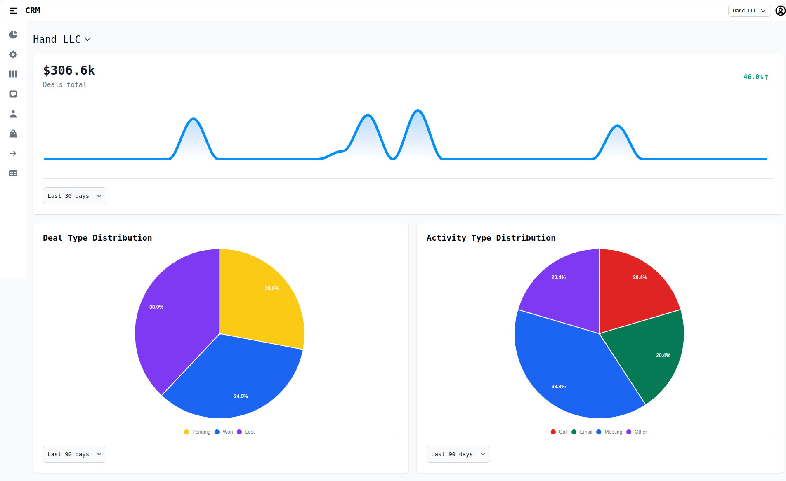
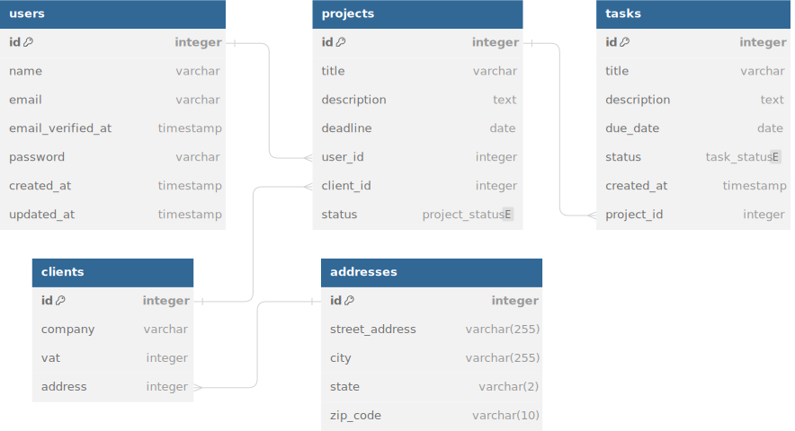

# NexusCRM

A Customer Relationship Management (CRM) application built with Laravel, React, and Inertia.js. This full-stack application helps businesses manage customer data, contacts, interactions, and user permissions efficiently.



## 🎯 **Key Features**

### Core CRM Functionality
- **Contact Management**: Comprehensive contact records with organizational affiliations
- **Company Management**: Track companies with addresses, industries, and relationships
- **Lead Management**: Capture and track leads from multiple sources (website, referral, etc.)
- **Deal Pipeline**: Manage deals with values, currencies, and status tracking (pending/won/lost)
- **Activity Tracking**: Log all interactions (calls, emails, meetings) with contacts and leads

### Advanced Features
- **Multi-tenant Architecture**: Support for multiple organizations within a single application
- **Organization Management**: Users can create/join multiple organizations
- **Invitation System**: Invite team members to join organizations
- **Role-Based Access Control (RBAC)**: Granular permissions system with custom roles per organization
- **User Authentication & Authorization**: Secure access with organization-scoped permissions

### Business Intelligence
- **Lead Source Tracking**: Identify where leads originate
- **Deal Status Management**: Track deals through the sales pipeline
- **Activity History**: Complete audit trail of all customer interactions

## 🛠️ **Tech Stack**

**Backend:**
- Laravel 10.x (PHP 8.1+)
- MySQL with complex relational schema
- RESTful API architecture
- Laravel Permissions (Spatie) for RBAC

**Frontend:**
- React.js with Hooks
- Inertia.js (SPA without building separate API)
- Tailwind CSS + Flowbite components
- Vite for blazing-fast builds

**Architecture:**
- Multi-tenant design pattern
- MVC with service layer
- Repository pattern for data access
- Event-driven interactions

**Testing & Quality:**
- PHPUnit for backend testing
- Feature and unit test coverage
- Database factories and seeders

<!-- ## 🚀 **Live Demo**

_Demo available upon request_ (or add deployed link here when ready) -->

## **Table of Contents**

* [Requirements](#requirements)
* [Installation](#installation)
* [Getting Started](#getting-started)
* [Database Schema](#database-schema)
* [Testing](#testing)
* [Project Structure](#project-structure)
* [Dependencies](#dependencies)
* [What I Learned](#what-i-learned)
* [Contributing](#contributing)
* [License](#license)

## **Requirements**

* PHP >= 8.1
* Composer
* MySQL
* Node.js and npm

## **Installation**

You can set up NexusCRM using either Docker (recommended) or traditional PHP/MySQL installation.

### **Option 1: Docker Setup (Recommended)** ⭐

**Prerequisites:**
- Docker
- Docker Compose
- Node.js and npm

**Steps:**

1. Clone the repository:
```sh
git clone https://github.com/samuelrods/NexusCRM.git
cd NexusCRM
```

2. Copy the environment file:
```sh
cp .env.example .env
```

3. Update `.env` with Docker database configuration:
```env
DB_CONNECTION=mysql
DB_HOST=db
DB_PORT=3306
DB_DATABASE=nexus_crm
DB_USERNAME=nexus
DB_PASSWORD=secret
```

Set to database for local dev to avoid API errors
```env
SCOUT_DRIVER=database
```

4. Build and start Docker containers:
```sh
docker-compose up -d --build
```

5. Install Dependencies (Inside Container):
```sh
docker-compose exec app composer install
docker-compose exec app npm install
```

6. Generate application key:
```sh
docker-compose exec app php artisan key:generate
```

7. Run migrations and seed the database:
```sh
docker-compose exec app php artisan migrate --seed
```

8. Build Frontend Assets:
```sh
docker-compose exec app npm run build
```

9. Access the application at `http://localhost:8000`

**Useful Docker Commands:**
```sh
# View logs
docker-compose logs -f app

# Stop containers
docker-compose down

# Restart containers
docker-compose restart

# Run artisan commands
docker-compose exec app php artisan [command]
```

---

### **Option 2: Traditional Setup**

**Prerequisites:**
- PHP >= 8.1
- Composer
- MySQL
- Node.js and npm

**Steps:**

1. Clone the project repository:
```sh
git clone https://github.com/samuelrods/NexusCRM.git
```

2. Enter the project directory:
```sh
cd NexusCRM
```

3. Install the Composer dependencies:
```sh
composer install
```

4. Install the npm dependencies:
```sh
npm install
```

5. Create a `.env` file from the provided `.env.example` file:
```sh
cp .env.example .env
```

6. Configure your database settings in the `.env` file

7. Generate the application key:
```sh
php artisan key:generate
```

8. Migrate the database:
```sh
php artisan migrate
```

9. Seed the database with sample data (optional):
```sh
php artisan db:seed
```

10. Start the development server:
```sh
php artisan serve
```

11. In a separate terminal, start the Vite dev server:
```sh
npm run dev
```

12. The application will be available at `http://localhost:8000`

## **Getting Started**

1. Start the development server:
```sh
php artisan serve
```

2. Start the Vite dev server (in a separate terminal):
```sh
npm run dev
```

3. The application will be available at `http://localhost:8000`

4. Login with seeded credentials (if you ran the seeder) or create a new account

## **Database Schema**

The application features a sophisticated multi-tenant database architecture with **15+ interconnected tables**:

[](https://dbdiagram.io/d/NEW-CRM-6577200d56d8064ca0cd099a)

### Core Entities
- **Users & Authentication**: User accounts with secure authentication
- **Organizations**: Multi-tenant support with organization isolation
- **Contacts**: Individual contact records with rich metadata
- **Companies**: Business entities with address and industry information
- **Leads**: Sales leads with source tracking and status management
- **Deals**: Opportunity tracking with values and close dates
- **Activities**: Comprehensive interaction logging (calls, emails, meetings)

### Advanced Features
- **Multi-tenancy**: Organization-scoped data with membership management
- **RBAC System**: Custom roles and permissions per organization
- **Invitation System**: Team member invitation workflow
- **Relationships**: Complex many-to-many and one-to-many relationships

### Key Database Patterns
✅ Proper normalization and referential integrity  
✅ Organization-scoped data isolation (multi-tenancy)  
✅ Flexible role and permission system  
✅ Audit trail capability through activity tracking

## **Testing**

The project includes unit and feature tests to ensure code quality and reliability.

To run tests:

1. Set up the testing environment:
```sh
cp .env.testing.example .env.testing
```

2. Build assets:
```sh
npm run build
```

3. Run the test suite:
```sh
php artisan test
```

## **Project Structure**
```
NexusCRM/
├── app/              # Application logic (Models, Controllers, Services)
├── config/           # Configuration files
├── database/         # Migrations, seeds, and factories
├── public/           # Public assets and entry point
├── resources/        # Views, React components, and frontend assets
├── routes/           # Application routes (web, api)
├── storage/          # Logs and uploaded files
├── tests/            # Unit and feature tests
└── vendor/           # Composer dependencies
```

## **Dependencies**

### Backend (PHP/Laravel)
- **Laravel Framework**: Core web application framework
- **laravel-permission**: Role and permission management
- **PHPUnit**: Testing framework

### Frontend (JavaScript/React)
- **React.js**: UI component library
- **Inertia.js**: Modern monolithic approach (SPA without building an API)
- **Tailwind CSS**: Utility-first CSS framework
- **Flowbite**: Tailwind component library
- **Vite**: Fast build tool and dev server

See `composer.json` and `package.json` for complete dependency lists.

## 🎓 **What I Learned**

Building this enterprise-level CRM application provided deep hands-on experience with:

### Backend Development
- **Multi-tenant Architecture**: Implementing organization-scoped data isolation
- **Complex Database Design**: Creating normalized schemas with 15+ interconnected tables
- **RBAC Implementation**: Building a flexible role and permission system using laravel-permission
- **Business Logic**: Modeling real-world CRM workflows (leads → deals → conversions)
- **Data Relationships**: Working with complex many-to-many and polymorphic relationships

### Full-stack Integration
- **Laravel + React + Inertia.js**: Seamless integration of backend and frontend
- **API Design**: Creating maintainable RESTful endpoints
- **State Management**: Handling complex application state across components
- **Authentication Flow**: Implementing secure, organization-aware authentication

### Software Engineering Practices
- **Testing**: Writing comprehensive unit and feature tests
- **Code Organization**: Following SOLID principles and Laravel best practices
- **Version Control**: Professional Git workflow and commit practices
- **Documentation**: Creating clear, maintainable documentation

This project represents a production-ready application architecture and significantly enhanced my understanding of enterprise software development patterns.

## 📝 **Future Improvements**

- [ ] Email notifications for follow-up reminders
- [ ] Advanced search and filtering capabilities
- [ ] Analytics dashboard with charts and metrics
- [ ] Export functionality (CSV, PDF reports)
- [ ] API documentation with Swagger/OpenAPI
- [ ] Calendar view for scheduled interactions

## **Contributing**

Contributions are welcome! Please feel free to submit a Pull Request.

## **License**

This project is licensed under the MIT License. See the LICENSE file for details.

---

<!-- ## 📧 **Contact**

Samuel Rodrigues - [Your LinkedIn] - [Your Email]

Project Link: [https://github.com/samuelrods/NexusCRM](https://github.com/samuelrods/NexusCRM) -->
